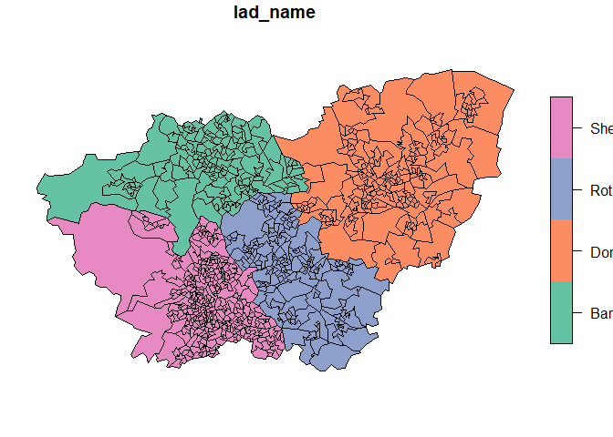
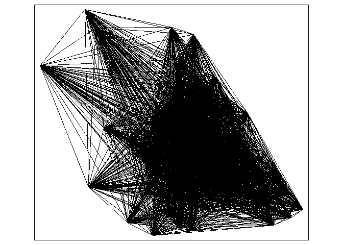

    library(remotes)
    library(rmarkdown)
    library(skimr)
    library(sf)

    ## Linking to GEOS 3.9.1, GDAL 3.3.2, PROJ 7.2.1; sf_use_s2() is TRUE

    library(pct)
    library(stats19)

    ## Data provided under OGL v3.0. Cite the source and link to:
    ## www.nationalarchives.gov.uk/doc/open-government-licence/version/3/

    library(tidyverse)

    ## ── Attaching packages ─────────────────────────────────────── tidyverse 1.3.1 ──

    ## ✔ ggplot2 3.3.6     ✔ purrr   0.3.4
    ## ✔ tibble  3.1.7     ✔ dplyr   1.0.9
    ## ✔ tidyr   1.2.0     ✔ stringr 1.4.0
    ## ✔ readr   2.1.2     ✔ forcats 0.5.1

    ## ── Conflicts ────────────────────────────────────────── tidyverse_conflicts() ──
    ## ✖ dplyr::filter() masks stats::filter()
    ## ✖ dplyr::lag()    masks stats::lag()

    library(tmap)
    library(tmaptools)
    library(knitr)

    tmap_mode("plot")

    ## tmap mode set to plotting

    cycle_trips = get_pct_rnet(region="south-yorkshire")
    zones= get_pct_zones("south-yorkshire")

## Number of cycle trips made on the current road network

    cycle_trips %>%
      select(bicycle) 

    ## Simple feature collection with 13959 features and 1 field
    ## Geometry type: LINESTRING
    ## Dimension:     XY
    ## Bounding box:  xmin: -1.80518 ymin: 53.22274 xmax: -0.78008 ymax: 53.72545
    ## Geodetic CRS:  WGS 84
    ## # A tibble: 13,959 × 2
    ##    bicycle                               geometry
    ##      <dbl>                       <LINESTRING [°]>
    ##  1       0 (-1.27382 53.49635, -1.27248 53.49629)
    ##  2       0 (-1.48455 53.46944, -1.48379 53.47005)
    ##  3       0 (-1.29962 53.49839, -1.29851 53.49817)
    ##  4       0 (-1.43687 53.35997, -1.43641 53.36001)
    ##  5       0 (-1.46206 53.53462, -1.46174 53.53453)
    ##  6       0 (-1.46525 53.39479, -1.46489 53.39552)
    ##  7       0 (-1.49211 53.42029, -1.49106 53.42011)
    ##  8       0  (-1.53732 53.4046, -1.53728 53.40514)
    ##  9       0 (-1.54144 53.32423, -1.54136 53.32433)
    ## 10       0 (-1.39724 53.34529, -1.39637 53.34574)
    ## # … with 13,949 more rows

\##South Yorkshire Regions

    zones %>% 
      select(lad_name) %>% 
      plot()

## LSOA regions within Sheffield

    zones_sheffield = zones%>% 
      filter(lad_name == "Sheffield") %>%
      select(lad11cd) %>%
      plot(main= "Sheffield")

    zones_sheffield2 = zones %>% 
      filter(lad_name == "Sheffield")

    rnet_sheffield = cycle_trips[zones_sheffield2, ]

## Cycle trips in Sheffield

    rnet_sheffield %>%
       select(bicycle) %>%
      plot(key.pos=1) 

## Cycle trips under the gender equality scenario

    rnet_sheffield %>%
      select(gendereq_slc) %>%
      plot(key.pos=1)

## Cycle trips under the Dutch scenario

    rnet_sheffield %>%
      select(dutch_slc) %>%
      plot(key.pos=1)

    desire = get_pct_lines(region = "south-yorkshire")

## Desire lines for the Dutch scenario (whole of South Yorkshire)

    plot(desire["dutch_slc"])

    desire_sheffield = desire %>%
       filter(lad_name1 == "Sheffield")

    View(desire_sheffield)

## Cycle desire lines for Sheffield

    plot(desire_sheffield["bicycle"], lwd = 1, key.pos = 1)

    tm_shape(desire_sheffield["bicycle"]) +
      tm_lines(palette = "plasma", lwd = "bicycle", scale = 9, alpha = 0.3)

## Current potential number of cycle journeys under the current scenario and current network

    rnet_sheffield %>%
      tm_shape() +
      tm_lines(col= "blueviolet", lwd = "bicycle", scale = 9, alpha = 0.6)

    rnet_sheffield %>%
      tm_shape() +
      tm_lines(col= "red", lwd = "ebike_slc", scale = 9)

    ## Legend labels were too wide. Therefore, legend.text.size has been set to 0.54. Increase legend.width (argument of tm_layout) to make the legend wider and therefore the labels larger.

    extra_tags= c("maxspeed", "bicycle")
    osm_data_region = osmextract::oe_get_network("south yorkshire", mode = "cycling", extra_tags = extra_tags)

    ## The input place was matched with: South Yorkshire

    ##   |                                                                              |                                                                      |   0%  |                                                                              |                                                                      |   1%  |                                                                              |=                                                                     |   1%  |                                                                              |=                                                                     |   2%  |                                                                              |==                                                                    |   2%  |                                                                              |==                                                                    |   3%  |                                                                              |====                                                                  |   6%  |                                                                              |=====                                                                 |   6%  |                                                                              |=====                                                                 |   7%  |                                                                              |=====                                                                 |   8%  |                                                                              |======                                                                |   8%  |                                                                              |======                                                                |   9%  |                                                                              |=======                                                               |   9%  |                                                                              |=======                                                               |  10%  |                                                                              |=======                                                               |  11%  |                                                                              |========                                                              |  11%  |                                                                              |========                                                              |  12%  |                                                                              |=========                                                             |  12%  |                                                                              |=========                                                             |  13%  |                                                                              |=========                                                             |  14%  |                                                                              |==========                                                            |  14%  |                                                                              |==========                                                            |  15%  |                                                                              |===========                                                           |  15%  |                                                                              |===========                                                           |  16%  |                                                                              |============                                                          |  16%  |                                                                              |============                                                          |  17%  |                                                                              |============                                                          |  18%  |                                                                              |=============                                                         |  18%  |                                                                              |=============                                                         |  19%  |                                                                              |==============                                                        |  19%  |                                                                              |==============                                                        |  20%  |                                                                              |==============                                                        |  21%  |                                                                              |===============                                                       |  21%  |                                                                              |===============                                                       |  22%  |                                                                              |================                                                      |  22%  |                                                                              |================                                                      |  23%  |                                                                              |================                                                      |  24%  |                                                                              |=================                                                     |  24%  |                                                                              |=================                                                     |  25%  |                                                                              |==================                                                    |  25%  |                                                                              |==================                                                    |  26%  |                                                                              |===================                                                   |  26%  |                                                                              |===================                                                   |  27%  |                                                                              |===================                                                   |  28%  |                                                                              |====================                                                  |  28%  |                                                                              |====================                                                  |  29%  |                                                                              |=====================                                                 |  29%  |                                                                              |=====================                                                 |  30%  |                                                                              |=====================                                                 |  31%  |                                                                              |======================                                                |  31%  |                                                                              |======================                                                |  32%  |                                                                              |=======================                                               |  32%  |                                                                              |=======================                                               |  33%  |                                                                              |=======================                                               |  34%  |                                                                              |========================                                              |  34%  |                                                                              |========================                                              |  35%  |                                                                              |=========================                                             |  35%  |                                                                              |=========================                                             |  36%  |                                                                              |==========================                                            |  36%  |                                                                              |==========================                                            |  37%  |                                                                              |==========================                                            |  38%  |                                                                              |===========================                                           |  38%  |                                                                              |===========================                                           |  39%  |                                                                              |============================                                          |  39%  |                                                                              |============================                                          |  40%  |                                                                              |============================                                          |  41%  |                                                                              |=============================                                         |  41%  |                                                                              |=============================                                         |  42%  |                                                                              |==============================                                        |  42%  |                                                                              |==============================                                        |  43%  |                                                                              |==============================                                        |  44%  |                                                                              |===============================                                       |  44%  |                                                                              |===============================                                       |  45%  |                                                                              |================================                                      |  45%  |                                                                              |================================                                      |  46%  |                                                                              |=================================                                     |  46%  |                                                                              |=================================                                     |  47%  |                                                                              |=================================                                     |  48%  |                                                                              |==================================                                    |  48%  |                                                                              |==================================                                    |  49%  |                                                                              |===================================                                   |  49%  |                                                                              |===================================                                   |  50%  |                                                                              |===================================                                   |  51%  |                                                                              |====================================                                  |  51%  |                                                                              |====================================                                  |  52%  |                                                                              |=====================================                                 |  52%  |                                                                              |=====================================                                 |  53%  |                                                                              |=====================================                                 |  54%  |                                                                              |======================================                                |  54%  |                                                                              |======================================                                |  55%  |                                                                              |=======================================                               |  55%  |                                                                              |=======================================                               |  56%  |                                                                              |========================================                              |  56%  |                                                                              |========================================                              |  57%  |                                                                              |========================================                              |  58%  |                                                                              |=========================================                             |  58%  |                                                                              |=========================================                             |  59%  |                                                                              |==========================================                            |  59%  |                                                                              |==========================================                            |  60%  |                                                                              |==========================================                            |  61%  |                                                                              |===========================================                           |  61%  |                                                                              |===========================================                           |  62%  |                                                                              |============================================                          |  62%  |                                                                              |============================================                          |  63%  |                                                                              |============================================                          |  64%  |                                                                              |=============================================                         |  64%  |                                                                              |=============================================                         |  65%  |                                                                              |==============================================                        |  65%  |                                                                              |==============================================                        |  66%  |                                                                              |===============================================                       |  66%  |                                                                              |===============================================                       |  67%  |                                                                              |===============================================                       |  68%  |                                                                              |================================================                      |  68%  |                                                                              |================================================                      |  69%  |                                                                              |=================================================                     |  69%  |                                                                              |=================================================                     |  70%  |                                                                              |=================================================                     |  71%  |                                                                              |==================================================                    |  71%  |                                                                              |==================================================                    |  72%  |                                                                              |===================================================                   |  72%  |                                                                              |===================================================                   |  73%  |                                                                              |===================================================                   |  74%  |                                                                              |====================================================                  |  74%  |                                                                              |====================================================                  |  75%  |                                                                              |=====================================================                 |  75%  |                                                                              |=====================================================                 |  76%  |                                                                              |======================================================                |  76%  |                                                                              |======================================================                |  77%  |                                                                              |======================================================                |  78%  |                                                                              |=======================================================               |  78%  |                                                                              |=======================================================               |  79%  |                                                                              |========================================================              |  79%  |                                                                              |========================================================              |  80%  |                                                                              |========================================================              |  81%  |                                                                              |=========================================================             |  81%  |                                                                              |=========================================================             |  82%  |                                                                              |==========================================================            |  82%  |                                                                              |==========================================================            |  83%  |                                                                              |===========================================================           |  84%  |                                                                              |===========================================================           |  85%  |                                                                              |============================================================          |  85%  |                                                                              |============================================================          |  86%  |                                                                              |=============================================================         |  86%  |                                                                              |=============================================================         |  87%  |                                                                              |=============================================================         |  88%  |                                                                              |==============================================================        |  88%  |                                                                              |==============================================================        |  89%  |                                                                              |===============================================================       |  89%  |                                                                              |===============================================================       |  90%  |                                                                              |===============================================================       |  91%  |                                                                              |================================================================      |  91%  |                                                                              |================================================================      |  92%  |                                                                              |=================================================================     |  92%  |                                                                              |=================================================================     |  93%  |                                                                              |=================================================================     |  94%  |                                                                              |==================================================================    |  94%  |                                                                              |==================================================================    |  95%  |                                                                              |===================================================================   |  95%  |                                                                              |===================================================================   |  96%  |                                                                              |====================================================================  |  96%  |                                                                              |====================================================================  |  97%  |                                                                              |====================================================================  |  98%  |                                                                              |===================================================================== |  98%  |                                                                              |===================================================================== |  99%  |                                                                              |======================================================================|  99%  |                                                                              |======================================================================| 100%

    ## File downloaded!

    ## Start with the vectortranslate operations on the input file!

    ## 0...10...20...30...40...50...60...70...80...90...100 - done.

    ## Finished the vectortranslate operations on the input file!

    ## Reading layer `lines' from data source 
    ##   `C:\Users\jspbe\AppData\Local\Temp\RtmpWujB3G\geofabrik_south-yorkshire-latest.gpkg' 
    ##   using driver `GPKG'
    ## Simple feature collection with 91449 features and 13 fields
    ## Geometry type: LINESTRING
    ## Dimension:     XY
    ## Bounding box:  xmin: -1.857621 ymin: 53.2878 xmax: -0.8204247 ymax: 53.67845
    ## Geodetic CRS:  WGS 84

    osm_sheffield = osm_data_region[zones_sheffield2, ]

    osm_sheffield %>%
      sf::st_drop_geometry() %>%
      skimr::skim()

<table>
<caption>Data summary</caption>
<tbody>
<tr class="odd">
<td style="text-align: left;">Name</td>
<td style="text-align: left;">Piped data</td>
</tr>
<tr class="even">
<td style="text-align: left;">Number of rows</td>
<td style="text-align: left;">37733</td>
</tr>
<tr class="odd">
<td style="text-align: left;">Number of columns</td>
<td style="text-align: left;">13</td>
</tr>
<tr class="even">
<td style="text-align: left;">_______________________</td>
<td style="text-align: left;"></td>
</tr>
<tr class="odd">
<td style="text-align: left;">Column type frequency:</td>
<td style="text-align: left;"></td>
</tr>
<tr class="even">
<td style="text-align: left;">character</td>
<td style="text-align: left;">12</td>
</tr>
<tr class="odd">
<td style="text-align: left;">numeric</td>
<td style="text-align: left;">1</td>
</tr>
<tr class="even">
<td style="text-align: left;">________________________</td>
<td style="text-align: left;"></td>
</tr>
<tr class="odd">
<td style="text-align: left;">Group variables</td>
<td style="text-align: left;">None</td>
</tr>
</tbody>
</table>

Data summary

**Variable type: character**

<table>
<colgroup>
<col style="width: 19%" />
<col style="width: 13%" />
<col style="width: 19%" />
<col style="width: 5%" />
<col style="width: 5%" />
<col style="width: 8%" />
<col style="width: 12%" />
<col style="width: 15%" />
</colgroup>
<thead>
<tr class="header">
<th style="text-align: left;">skim_variable</th>
<th style="text-align: right;">n_missing</th>
<th style="text-align: right;">complete_rate</th>
<th style="text-align: right;">min</th>
<th style="text-align: right;">max</th>
<th style="text-align: right;">empty</th>
<th style="text-align: right;">n_unique</th>
<th style="text-align: right;">whitespace</th>
</tr>
</thead>
<tbody>
<tr class="odd">
<td style="text-align: left;">osm_id</td>
<td style="text-align: right;">0</td>
<td style="text-align: right;">1.00</td>
<td style="text-align: right;">7</td>
<td style="text-align: right;">10</td>
<td style="text-align: right;">0</td>
<td style="text-align: right;">37733</td>
<td style="text-align: right;">0</td>
</tr>
<tr class="even">
<td style="text-align: left;">name</td>
<td style="text-align: right;">23420</td>
<td style="text-align: right;">0.38</td>
<td style="text-align: right;">3</td>
<td style="text-align: right;">42</td>
<td style="text-align: right;">0</td>
<td style="text-align: right;">6524</td>
<td style="text-align: right;">0</td>
</tr>
<tr class="odd">
<td style="text-align: left;">highway</td>
<td style="text-align: right;">0</td>
<td style="text-align: right;">1.00</td>
<td style="text-align: right;">4</td>
<td style="text-align: right;">14</td>
<td style="text-align: right;">0</td>
<td style="text-align: right;">21</td>
<td style="text-align: right;">0</td>
</tr>
<tr class="even">
<td style="text-align: left;">waterway</td>
<td style="text-align: right;">37733</td>
<td style="text-align: right;">0.00</td>
<td style="text-align: right;">NA</td>
<td style="text-align: right;">NA</td>
<td style="text-align: right;">0</td>
<td style="text-align: right;">0</td>
<td style="text-align: right;">0</td>
</tr>
<tr class="odd">
<td style="text-align: left;">aerialway</td>
<td style="text-align: right;">37733</td>
<td style="text-align: right;">0.00</td>
<td style="text-align: right;">NA</td>
<td style="text-align: right;">NA</td>
<td style="text-align: right;">0</td>
<td style="text-align: right;">0</td>
<td style="text-align: right;">0</td>
</tr>
<tr class="even">
<td style="text-align: left;">barrier</td>
<td style="text-align: right;">37733</td>
<td style="text-align: right;">0.00</td>
<td style="text-align: right;">NA</td>
<td style="text-align: right;">NA</td>
<td style="text-align: right;">0</td>
<td style="text-align: right;">0</td>
<td style="text-align: right;">0</td>
</tr>
<tr class="odd">
<td style="text-align: left;">man_made</td>
<td style="text-align: right;">37728</td>
<td style="text-align: right;">0.00</td>
<td style="text-align: right;">4</td>
<td style="text-align: right;">10</td>
<td style="text-align: right;">0</td>
<td style="text-align: right;">3</td>
<td style="text-align: right;">0</td>
</tr>
<tr class="even">
<td style="text-align: left;">access</td>
<td style="text-align: right;">37340</td>
<td style="text-align: right;">0.01</td>
<td style="text-align: right;">2</td>
<td style="text-align: right;">11</td>
<td style="text-align: right;">0</td>
<td style="text-align: right;">9</td>
<td style="text-align: right;">0</td>
</tr>
<tr class="odd">
<td style="text-align: left;">bicycle</td>
<td style="text-align: right;">35609</td>
<td style="text-align: right;">0.06</td>
<td style="text-align: right;">3</td>
<td style="text-align: right;">11</td>
<td style="text-align: right;">0</td>
<td style="text-align: right;">5</td>
<td style="text-align: right;">0</td>
</tr>
<tr class="even">
<td style="text-align: left;">service</td>
<td style="text-align: right;">35485</td>
<td style="text-align: right;">0.06</td>
<td style="text-align: right;">5</td>
<td style="text-align: right;">16</td>
<td style="text-align: right;">0</td>
<td style="text-align: right;">8</td>
<td style="text-align: right;">0</td>
</tr>
<tr class="odd">
<td style="text-align: left;">maxspeed</td>
<td style="text-align: right;">32034</td>
<td style="text-align: right;">0.15</td>
<td style="text-align: right;">1</td>
<td style="text-align: right;">6</td>
<td style="text-align: right;">0</td>
<td style="text-align: right;">13</td>
<td style="text-align: right;">0</td>
</tr>
<tr class="even">
<td style="text-align: left;">other_tags</td>
<td style="text-align: right;">20746</td>
<td style="text-align: right;">0.45</td>
<td style="text-align: right;">11</td>
<td style="text-align: right;">399</td>
<td style="text-align: right;">0</td>
<td style="text-align: right;">4322</td>
<td style="text-align: right;">0</td>
</tr>
</tbody>
</table>

**Variable type: numeric**

<table>
<colgroup>
<col style="width: 18%" />
<col style="width: 13%" />
<col style="width: 18%" />
<col style="width: 6%" />
<col style="width: 6%" />
<col style="width: 5%" />
<col style="width: 5%" />
<col style="width: 5%" />
<col style="width: 5%" />
<col style="width: 6%" />
<col style="width: 8%" />
</colgroup>
<thead>
<tr class="header">
<th style="text-align: left;">skim_variable</th>
<th style="text-align: right;">n_missing</th>
<th style="text-align: right;">complete_rate</th>
<th style="text-align: right;">mean</th>
<th style="text-align: right;">sd</th>
<th style="text-align: right;">p0</th>
<th style="text-align: right;">p25</th>
<th style="text-align: right;">p50</th>
<th style="text-align: right;">p75</th>
<th style="text-align: right;">p100</th>
<th style="text-align: left;">hist</th>
</tr>
</thead>
<tbody>
<tr class="odd">
<td style="text-align: left;">z_order</td>
<td style="text-align: right;">0</td>
<td style="text-align: right;">1</td>
<td style="text-align: right;">1.67</td>
<td style="text-align: right;">3.33</td>
<td style="text-align: right;">-20</td>
<td style="text-align: right;">0</td>
<td style="text-align: right;">0</td>
<td style="text-align: right;">3</td>
<td style="text-align: right;">64</td>
<td style="text-align: left;">▁▇▁▁▁</td>
</tr>
</tbody>
</table>

    osm_cycleways = osm_sheffield %>%
      filter(highway == "cycleway")

    qtm(osm_cycleways)

    osm_speed = osm_sheffield %>%
      select(maxspeed)

    plot(osm_speed, key.pos = 1, lwd = "maxspeed",)

    osm_sheffield %>%
      tm_shape() +
      tm_lines("maxspeed")

    qtm(osm_speed)

    sheffield_region = osmdata::getbb("Sheffield", format_out = "sf_polygon", limit = "1") %>%
      plot()

    orig_dest = get_od(region = "south-yorkshire")

    ## 
    ## ── Column specification ────────────────────────────────────────────────────────
    ## cols(
    ##   `Area of residence` = col_character(),
    ##   `Area of workplace` = col_character(),
    ##   `All categories: Method of travel to work` = col_double(),
    ##   `Work mainly at or from home` = col_double(),
    ##   `Underground, metro, light rail, tram` = col_double(),
    ##   Train = col_double(),
    ##   `Bus, minibus or coach` = col_double(),
    ##   Taxi = col_double(),
    ##   `Motorcycle, scooter or moped` = col_double(),
    ##   `Driving a car or van` = col_double(),
    ##   `Passenger in a car or van` = col_double(),
    ##   Bicycle = col_double(),
    ##   `On foot` = col_double(),
    ##   `Other method of travel to work` = col_double()
    ## )

    ## 
    ## ── Column specification ────────────────────────────────────────────────────────
    ## cols(
    ##   MSOA11CD = col_character(),
    ##   MSOA11NM = col_character(),
    ##   BNGEAST = col_double(),
    ##   BNGNORTH = col_double(),
    ##   LONGITUDE = col_double(),
    ##   LATITUDE = col_double()
    ## )

    sy_msoa = get_pct_zones("south-yorkshire", geography = "msoa")

    sheffield_msoa = sy_msoa %>%
      filter(lad_name == "Sheffield")

    sheffield_od = orig_dest %>%
      filter(orig_dest$geo_code1 %in% sheffield_msoa$geo_code == TRUE)

    zones_attr = sheffield_od %>%
      group_by(geo_code1) %>%
      summarize_if(is.numeric, sum) %>%
      dplyr::rename(geo_code = geo_code1)

    view(sheffield_od)

    summary(zones_attr$geo_code %in% sheffield_msoa$geo_code)

    ##    Mode    TRUE 
    ## logical      70

    zones_joined = left_join(sheffield_msoa, zones_attr, by = "geo_code")
    sum(zones_joined$all.x)

    ## [1] 226477

    names(zones_joined)

    ##   [1] "geo_code"                "geo_name"               
    ##   [3] "lad11cd"                 "lad_name"               
    ##   [5] "all.x"                   "bicycle.x"              
    ##   [7] "foot.x"                  "car_driver.x"           
    ##   [9] "car_passenger.x"         "motorbike.x"            
    ##  [11] "train_tube"              "bus.x"                  
    ##  [13] "taxi_other"              "govtarget_slc"          
    ##  [15] "govtarget_sic"           "govtarget_slw"          
    ##  [17] "govtarget_siw"           "govtarget_sld"          
    ##  [19] "govtarget_sid"           "govtarget_slp"          
    ##  [21] "govtarget_sip"           "govtarget_slm"          
    ##  [23] "govtarget_sim"           "govtarget_slpt"         
    ##  [25] "govtarget_sipt"          "govnearmkt_slc"         
    ##  [27] "govnearmkt_sic"          "govnearmkt_slw"         
    ##  [29] "govnearmkt_siw"          "govnearmkt_sld"         
    ##  [31] "govnearmkt_sid"          "govnearmkt_slp"         
    ##  [33] "govnearmkt_sip"          "govnearmkt_slm"         
    ##  [35] "govnearmkt_sim"          "govnearmkt_slpt"        
    ##  [37] "govnearmkt_sipt"         "gendereq_slc"           
    ##  [39] "gendereq_sic"            "gendereq_slw"           
    ##  [41] "gendereq_siw"            "gendereq_sld"           
    ##  [43] "gendereq_sid"            "gendereq_slp"           
    ##  [45] "gendereq_sip"            "gendereq_slm"           
    ##  [47] "gendereq_sim"            "gendereq_slpt"          
    ##  [49] "gendereq_sipt"           "dutch_slc"              
    ##  [51] "dutch_sic"               "dutch_slw"              
    ##  [53] "dutch_siw"               "dutch_sld"              
    ##  [55] "dutch_sid"               "dutch_slp"              
    ##  [57] "dutch_sip"               "dutch_slm"              
    ##  [59] "dutch_sim"               "dutch_slpt"             
    ##  [61] "dutch_sipt"              "ebike_slc"              
    ##  [63] "ebike_sic"               "ebike_slw"              
    ##  [65] "ebike_siw"               "ebike_sld"              
    ##  [67] "ebike_sid"               "ebike_slp"              
    ##  [69] "ebike_sip"               "ebike_slm"              
    ##  [71] "ebike_sim"               "ebike_slpt"             
    ##  [73] "ebike_sipt"              "base_slcyclehours"      
    ##  [75] "govtarget_sicyclehours"  "govnearmkt_sicyclehours"
    ##  [77] "gendereq_sicyclehours"   "dutch_sicyclehours"     
    ##  [79] "ebike_sicyclehours"      "base_sldeath"           
    ##  [81] "base_slyll"              "base_slvalueyll"        
    ##  [83] "base_slsickdays"         "base_slvaluesick"       
    ##  [85] "base_slvaluecomb"        "govtarget_sideath"      
    ##  [87] "govtarget_siyll"         "govtarget_sivalueyll"   
    ##  [89] "govtarget_sisickdays"    "govtarget_sivaluesick"  
    ##  [91] "govtarget_sivaluecomb"   "govnearmkt_sideath"     
    ##  [93] "govnearmkt_siyll"        "govnearmkt_sivalueyll"  
    ##  [95] "govnearmkt_sisickdays"   "govnearmkt_sivaluesick" 
    ##  [97] "govnearmkt_sivaluecomb"  "gendereq_sideath"       
    ##  [99] "gendereq_siyll"          "gendereq_sivalueyll"    
    ## [101] "gendereq_sisickdays"     "gendereq_sivaluesick"   
    ## [103] "gendereq_sivaluecomb"    "dutch_sideath"          
    ## [105] "dutch_siyll"             "dutch_sivalueyll"       
    ## [107] "dutch_sisickdays"        "dutch_sivaluesick"      
    ## [109] "dutch_sivaluecomb"       "ebike_sideath"          
    ## [111] "ebike_siyll"             "ebike_sivalueyll"       
    ## [113] "ebike_sisickdays"        "ebike_sivaluesick"      
    ## [115] "ebike_sivaluecomb"       "base_slcarkm"           
    ## [117] "base_slco2"              "govtarget_sicarkm"      
    ## [119] "govtarget_sico2"         "govnearmkt_sicarkm"     
    ## [121] "govnearmkt_sico2"        "gendereq_sicarkm"       
    ## [123] "gendereq_sico2"          "dutch_sicarkm"          
    ## [125] "dutch_sico2"             "ebike_sicarkm"          
    ## [127] "ebike_sico2"             "perc_rf_dist_u10km"     
    ## [129] "avslope_perc_u10km"      "geometry"               
    ## [131] "all.y"                   "from_home"              
    ## [133] "light_rail"              "train"                  
    ## [135] "bus.y"                   "taxi"                   
    ## [137] "motorbike.y"             "car_driver.y"           
    ## [139] "car_passenger.y"         "bicycle.y"              
    ## [141] "foot.y"                  "other"

    zones_od = sheffield_od %>%
      group_by(geo_code1) %>%
      summarise_if(is.numeric, sum) %>%
      dplyr::select(geo_code = geo_code1, all_dest = all) %>%
      inner_join(zones_joined, ., by = "geo_code")

    qtm(zones_od, c("all.x", "all.y", "all_dest")) +
      tm_text(text = c("all.x", "all.y", "all_dest"), size = 0.5) +
      tm_layout(panel.labels = c("Origin","Y", "Destination"))

    sheffield_od$Active = (sheffield_od$bicycle + sheffield_od$foot) / sheffield_od$all * 100

    od_intra = filter(sheffield_od, geo_code1 == geo_code2)

    od_inter = filter(sheffield_od, geo_code1 != geo_code2)

    view(zones_od)

    od_inter %>%
      dplyr::rename(geo_code = geo_code1)

    ## # A tibble: 21,734 × 19
    ##    geo_code  geo_code2   all from_home light_rail train   bus  taxi motorbike
    ##    <chr>     <chr>     <dbl>     <dbl>      <dbl> <dbl> <dbl> <dbl>     <dbl>
    ##  1 E02001611 E02000136     1         0          0     0     1     0         0
    ##  2 E02001611 E02000470     1         0          0     0     0     0         0
    ##  3 E02001611 E02000476     1         0          0     0     0     0         0
    ##  4 E02001611 E02000573     1         0          0     1     0     0         0
    ##  5 E02001611 E02000576     1         0          0     0     0     0         0
    ##  6 E02001611 E02000586     1         0          0     0     0     0         0
    ##  7 E02001611 E02000808     1         0          1     0     0     0         0
    ##  8 E02001611 E02000980     1         0          0     1     0     0         0
    ##  9 E02001611 E02000990     1         0          0     0     0     0         0
    ## 10 E02001611 E02001017     1         0          0     0     0     0         0
    ## # … with 21,724 more rows, and 10 more variables: car_driver <dbl>,
    ## #   car_passenger <dbl>, bicycle <dbl>, foot <dbl>, other <dbl>,
    ## #   geo_name1 <chr>, geo_name2 <chr>, la_1 <chr>, la_2 <chr>, Active <dbl>

    od_internew = od_inter %>%
      filter(la_2 == "Sheffield")

    desire_lines = stplanr::od2line(od_internew, zones_od)

    ## Creating centroids representing desire line start and end points.

    qtm(desire_lines, lwd = "all")

    od_top5 = sheffield_od %>% 
        arrange(desc(all)) %>% 
        top_n(5, wt = all)

    tmap_mode("plot")

    ## tmap mode set to plotting

    desire_lines_top5 = stplanr::od2line(od_internew, zones_od)

    ## Creating centroids representing desire line start and end points.

    #tmaptools::palette_explorer()
    tm_shape(desire_lines) +
      tm_lines(palette = "plasma", breaks = c(0, 5, 10, 20, 40, 100),
        lwd = "all",
        scale = 9,
        title.lwd = "Number of trips",
        alpha = 0.2,
        col = "Active",
        title = "Active travel (%)"
      )

    desire_lines$distance = as.numeric(st_length(desire_lines))

    desire_carshort = dplyr::filter(desire_lines, car_driver > 100 & distance < 5000)

    route_carshort = stplanr::route(desire_carshort, route_fun = stplanr::route_osrm)

    ## Most common output is sf

    desire_carshort$geom_car = st_geometry(route_carshort)

    centroids = st_geometry(st_centroid(zones_od))

    plot(st_geometry(desire_carshort))
    plot(desire_carshort$geom_car, col = "red", add = TRUE)
    plot(centroids, add = TRUE)

