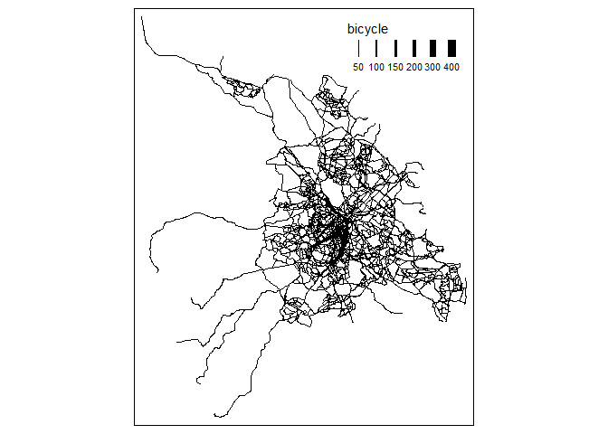

    library(remotes)
    library(rmarkdown)
    library(skimr)
    library(sf)

    ## Linking to GEOS 3.9.1, GDAL 3.3.2, PROJ 7.2.1; sf_use_s2() is TRUE

    library(pct)
    library(stats19)

    ## Data provided under OGL v3.0. Cite the source and link to:
    ## www.nationalarchives.gov.uk/doc/open-government-licence/version/3/

    library(tidyverse)

    ## ── Attaching packages ─────────────────────────────────────── tidyverse 1.3.1 ──

    ## ✔ ggplot2 3.3.6     ✔ purrr   0.3.4
    ## ✔ tibble  3.1.7     ✔ dplyr   1.0.9
    ## ✔ tidyr   1.2.0     ✔ stringr 1.4.0
    ## ✔ readr   2.1.2     ✔ forcats 0.5.1

    ## ── Conflicts ────────────────────────────────────────── tidyverse_conflicts() ──
    ## ✖ dplyr::filter() masks stats::filter()
    ## ✖ dplyr::lag()    masks stats::lag()

    library(tmap)
    library(tmaptools)
    library(knitr)

    tmap_mode("plot")

    ## tmap mode set to plotting

    cycle_trips = get_pct_rnet(region="south-yorkshire")
    zones= get_pct_zones("south-yorkshire")

    View(cycle_trips)

    cycle_trips %>%
      select(bicycle) %>% 
      plot()

    zones %>% 
      select(lad_name) %>% 
      plot()

    zones_sheffield = zones%>% 
      filter(lad_name == "Sheffield") %>%
      select(lad11cd) %>%
      plot(color = "deepskyblue", fill= NA, main= "Sheffield")

    ## Warning in title(...): "color" is not a graphical parameter

    ## Warning in title(...): "fill" is not a graphical parameter

    ## Warning in title(...): "color" is not a graphical parameter

    ## Warning in title(...): "fill" is not a graphical parameter

    zones_sheffield2 = zones %>% 
      filter(lad_name == "Sheffield")

    rnet_sheffield = cycle_trips[zones_sheffield2, ]

    rnet_sheffield %>%
       select(bicycle) %>%
      plot(key.pos=1) 

    rnet_sheffield %>%
      select(gendereq_slc) %>%
      plot(key.pos=1)

    rnet_sheffield %>%
      select(dutch_slc) %>%
      plot(key.pos=1)

    View(pct_regions_lookup)

    desire = get_pct_lines(region = "south-yorkshire")

    View(desire)

    plot(desire["dutch_slc"])

    desire_sheffield = desire %>%
       filter(lad_name1 == "Sheffield")

    plot(desire_sheffield)

    ## Warning: plotting the first 9 out of 141 attributes; use max.plot = 141 to plot
    ## all

    View(desire_sheffield)

    plot(desire_sheffield["bicycle"], key.pos=1,)

    rnet_sheffield %>%
      tm_shape() +
      tm_lines(lwd = "bicycle", scale = 9, col =)

